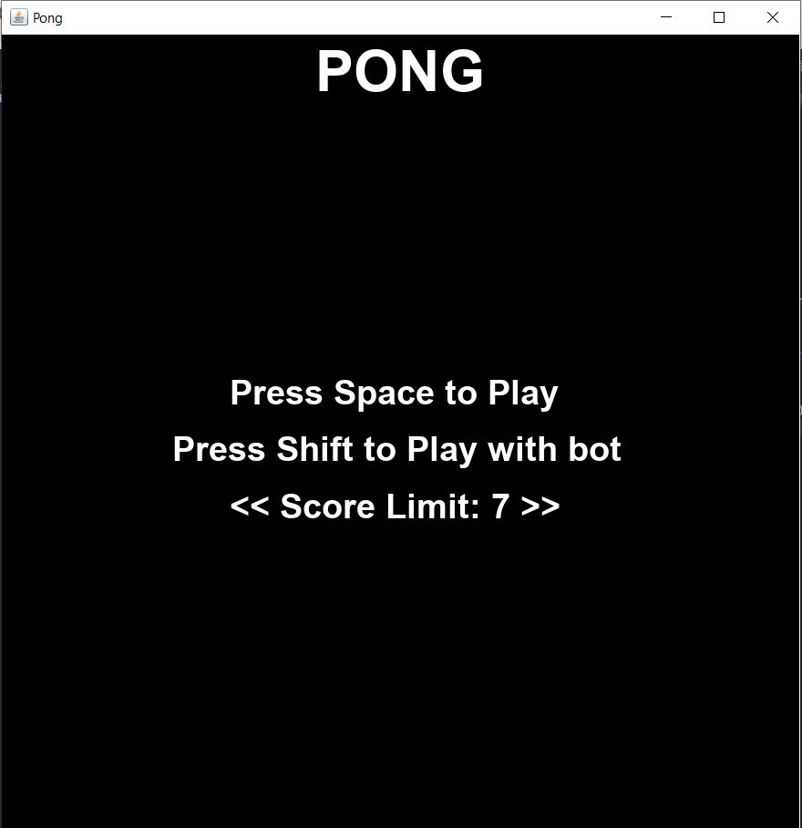
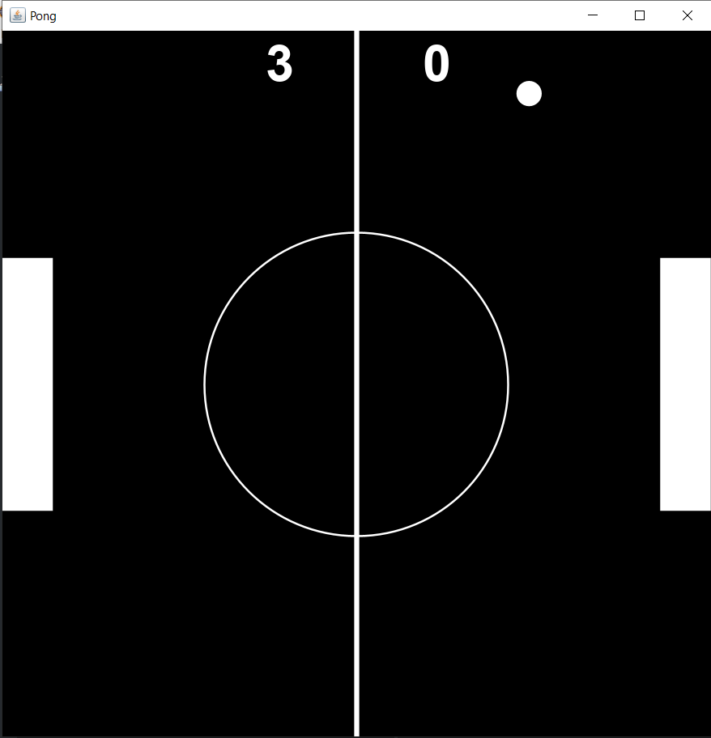
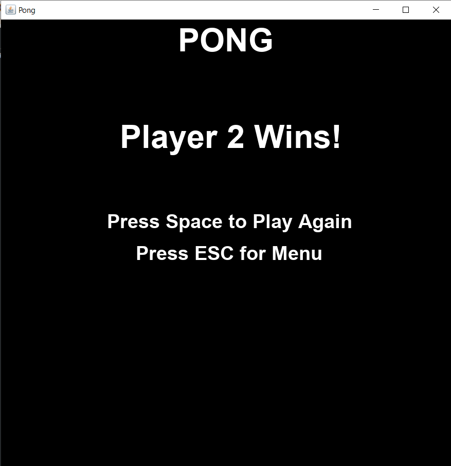

# Pong
Recreated the famous game pong in which you can play against a bot and also choose the difficulty of the bot. The game is basically two paddles on either side and you hit the ball back and forth until the ball hits either wall. This project reinforced my knowledge of OOP in java, graphics, hit collision, rendering, and the ability to include a bot that you can play against as well as being able to add different levels of difficulty

